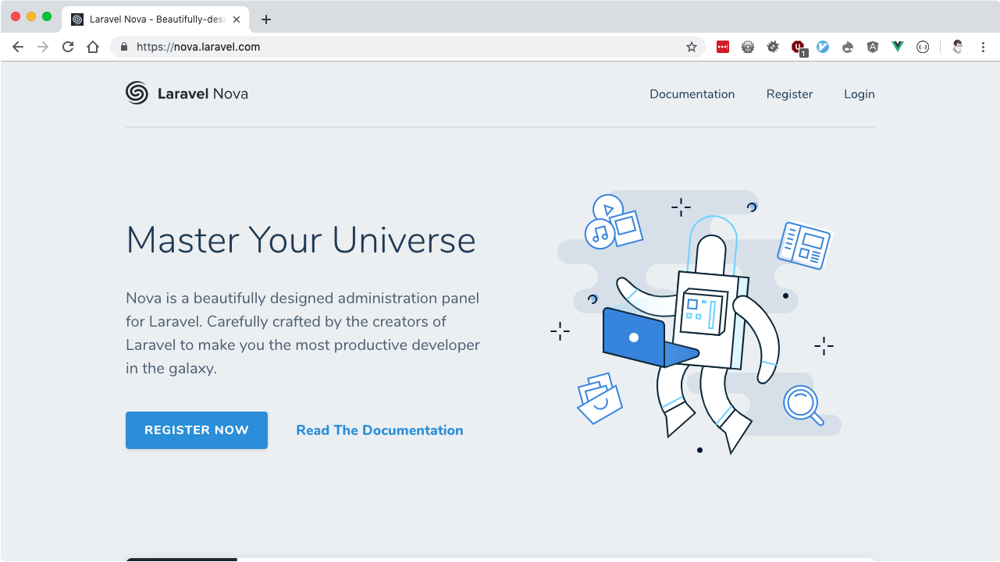

# Taking Flight with _Tailwind CSS_
<!-- .element class="mx-auto max-w-3xl text-6xl font-extrabold text-center" -->

By Oliver Davies
<!-- .element class="mt-8 text-center text-gray-900" -->

<!--s-->

## Fun fact: these slides are *built with Tailwind CSS*
<!-- .element class="mx-auto max-w-3xl text-6xl leading-snug font-extrabold text-center" -->

<!--s-->

<div class="grid grid-cols-5 gap-10">
<div class="grid col-span-4">
<div class="flex items-center">

- Full Stack Software Developer & System Administrator
- Senior Software Engineer at Inviqa
- Part-time freelancer
- https://www.oliverdavies.uk
- https://www.drupal.org/u/opdavies
- https://twitter.com/opdavies

</div>
</div>

<div class="col-span-1">


</div>
</div>

Note: - I maintain Drupal modules, PHP CLI tools and libraries, Ansible roles
- Blog on my website
- I work primarily with Drupal and Symfony I work for Inviqa, but this
based on my personal and side projects.

<!--v-->

<!-- .slide: class="flex items-center justify-center" -->


<!--s-->

## What is Tailwind CSS?
<!-- .element: class="text-6xl text-center" -->

<!--v-->

## A **utility-first** CSS framework for rapidly building **custom designs**.
<!-- .element: class="text-6xl text-center" -->

Note: CSS utility class generator PostCSS Make different looking sites using the
same class names No "Tailwind looking site" like there is with Bootstrap

<!--v-->

## Tailwind CSS is a *highly customizable*, *low-level* CSS framework
<!-- .element: class="text-6xl text-center" -->

Note: No components like Bootstrap or Bulma Configure it per project Extendable if
needed via additional plugins Avoids the need to name things prematurely Can
extract components if needed (reusability)

<!--v-->

## Tailwind is more than a CSS framework, it's an *engine for creating design systems*
<!-- .element: class="text-6xl text-center" -->

Note: Good default values provided - colours, fonts, padding, widths Designing with
constraints. Using inline styles, every value is a magic number. With utilities,
you're choosing styles from a predefined design system, which makes it much
easier to build visually consistent UIs.

<!--v-->

- Text/border/background colours
<!-- .element: class="fragment" -->
- Font size/family/weight
<!-- .element: class="fragment" -->
- Alignment
<!-- .element: class="fragment" -->
- Padding/margin/negative margin
<!-- .element: class="fragment" -->
- Flexbox
<!-- .element: class="fragment" -->
- Positioning
<!-- .element: class="fragment" -->
- Lists
<!-- .element: class="fragment" -->
- z-index
<!-- .element: class="fragment" -->
- Opacity
<!-- .element: class="fragment" -->

Note: Some of the 'original' things that Tailwind would generate classes for.

<!--v-->

- Screenreader visibility
<!-- .element: class="fragment" -->
- Placeholder colour
<!-- .element: class="fragment" -->
- first-child, last-child, nth-child
<!-- .element: class="fragment" -->
- CSS Grid
<!-- .element: class="fragment" -->
- Transition
<!-- .element: class="fragment" -->
- Transform
<!-- .element: class="fragment" -->
- Spacing / Divide
<!-- .element: class="fragment" -->

Note: All generated from a single, customisable configuration file.

<!--v-->



<!--v-->


<!--v-->


<!--s-->

<!-- .slide: class="flex items-center justify-center" -->

## How do I use Tailwind?
<!-- .element: class="text-6xl text-center" -->

Note: From the new tailwindcss.com website

<!--v-->

## With Tailwind, you style elements <br>by *applying pre-existing classes* directly in your HTML
<!-- .element: class="text-6xl text-center" -->

<!--v-->

<!-- .slide: class="flex items-center justify-center text-center" -->

## Using *utility classes* to build custom designs *without writing CSS*
<!-- .element: class="text-6xl text-center" -->

<!--v-->

## Benefits

- You aren't wasting time and energy inventing class names
<!-- .element: class="fragment" -->
- Your CSS stops growing
<!-- .element: class="fragment" -->
- Making changes feels safer
<!-- .element: class="fragment" -->

Note: No more adding silly class names like sidebar-inner-wrapper just to be able to
style something, and no more agonizing over the perfect abstract name for
something that's really just a flex container.

Using a traditional approach, your CSS files get bigger every time you add a
new feature. With utilities, everything is reusable so you rarely need to write
new CSS.

CSS is global and you never know what you're breaking when you make a change.
Classes in your HTML are local, so you can change them without worrying about
something else breaking.

<!--s-->

<!-- .slide: class="flex items-center justify-center text-center" -->


<!--v-->

<!-- .slide: class="flex items-center justify-center text-center" -->


Note: Add padding with p-6

<!--v-->

<!-- .slide: class="flex items-center justify-center text-center" -->


Note: Rounded image - rounded-full

<!--v-->

<!-- .slide: class="flex items-center justify-center text-center" -->


Note: Centre image using mx-auto

<!--v-->

<!-- .slide: class="flex items-center justify-center text-center" -->


Note: Larger text - text-lg

<!--v-->

<!-- .slide: class="flex items-center justify-center text-center" -->


Note: Purple text - text-purple-500

<!--v-->

<!-- .slide: class="flex items-center justify-center text-center" -->


Note: Grey text - text-gray-600

<!--v-->

<!-- .slide: class="flex items-center justify-center text-center" -->


Note: Centre text - text-center

<!--s-->

## How do I install Tailwind?
<!-- .element: class="text-6xl text-center" -->

<!--v-->

## 1. Use the CDN
<!-- .element: class="text-6xl text-center" -->

<!--v-->

## https://unpkg.com/tailwindcss/dist/tailwind.min.css
<!-- .element: class="text-6xl text-center" -->

<!--v-->

## To get the most out of Tailwind, <br>*you really should install it via npm*
<!-- .element: class="text-6xl text-center" -->

Note: - You can't customize Tailwind's default theme

- You can't use any directives like _@apply_, _@variants_, etc.
- You can't enable features like _group-hover_
- You can't install third-party plugins

<!--v-->

## 2. Installing Tailwind via NPM
<!-- .element: class="text-6xl text-center" -->

<!--v-->

## `npm install --save-dev` <br>`tailwindcss`
<!-- .element: class="text-6xl text-center font-normal" -->

## `yarn add -D tailwindcss`
<!-- .element: class="mt-20 text-6xl text-center font-normal" -->

Note: Adds it as a dependency to your package.json file

<!--s-->

## Adding Tailwind to your CSS
<!-- .element class="text-6xl text-center" -->

<!--v-->

```scss
/* src/css/app.pcss */

@tailwind base;

@tailwind components;

@tailwind utilities;
```

<!--v-->

```
/* src/css/app.pcss */

@tailwind base;
/* Custom base styles */

@tailwind components;
/* Custom components */

@tailwind utilities;
/* Custom utilities */
```
<!-- .element: class="text-3xl" -->

<!--s-->

## Processing your CSS with the *build command*
<!-- .element: class="text-6xl text-center" -->

Note: Compile the generated CSS Pass through PostCSS and Tailwind

<!--v-->

<!-- .slide: class="text-center" -->

# `npx tailwind build` <br>`src/css/app.pcss` <br>`-o build/app.css`

<!--v-->

```css
.text-left {
  text-align: left;
}

.text-center {
  text-align: center;
}

.text-right {
  text-align: right;
}

.text-justify {
  text-align: justify;
}
```
<!-- .element: class="text-2xl" -->

<!--s-->

## Processing your CSS with *Webpack Encore*
<!-- .element: class="text-6xl text-center" -->

<!--v-->

# `npm install --save-dev @symfony/webpack-encore`

<!--v-->

```js
// webpack.config.js

let Encore = require('@symfony/webpack-encore')

Encore
  .disableSingleRuntimeChunk()
  .setOutputPath('build/')
  .setPublicPath('/build')
  .addStyleEntry('app', './assets/css/tailwind.pcss')
  .enablePostCssLoader()

module.exports = Encore.getWebpackConfig()
```
<!-- .element: class="text-3xl" -->


Note: PostCSS - useful if you're including other PostCSS plugins like PostCSS Nested

<!--v-->

```js
// postcss.config.js

module.exports = {
  plugins: [
    require('tailwindcss')
  ]
}
```

<!--v-->

```plain
$ npx encore dev

Running webpack ...

DONE  Compiled successfully in 1705ms                                                   

1 files written to build

Entrypoint app [big] = app.css
```

<!--v-->

```html
<!DOCTYPE html>
<html lang="en">
  <head>
    <meta charset="UTF-8" />
    <title>My new website</title>
    <link rel="stylesheet" href="/build/app.css" />
  </head>
  <body></body>
</html>
```
<!-- .element class="text-3xl" -->

<!--s-->

## Interaction states
<!-- .element: class="text-6xl text-center" -->

## hover, focus, active, disabled, visited, <br>group-hover, focus-within, <br>first-child, last-child...
<!-- .element: class="text-4xl text-center text-gray-700" -->

Note: Start to differ from inline styles

<!--v-->

# `[state][separator][class]`
<!-- .element: class="text-6xl text-center" -->

Note: State = hover, focus, group focus, focus within Separator = configurable,
colon by default Class = the same utility class that you would have used normally

<!--v-->

`hover:text-red-500`
<!-- .element: class="text-6xl text-center" -->

<!--v-->

```css
.text-red-500 {
  color: #f56565;
}

.hover\:text-red-500:hover {
  color: #f56565;
}

.focus\:text-red-500:focus {
  color: #f56565;
}
```
<!-- .element class="text-3xl" -->

<!--v-->

```html
<a
  href="#"
  class="text-red-500 hover:text-red-800"
>
  Read more
</a>
```
<!-- .element class="text-4xl" -->

<!--v-->

```js
// defaultConfig.stub.js

variants: {
  alignContent: ['responsive'],
  alignItems: ['responsive'],
  alignSelf: ['responsive'],
  appearance: ['responsive'],
  backgroundAttachment: ['responsive'],
  backgroundColor: ['responsive', 'hover', 'focus'],
  backgroundPosition: ['responsive'],
  backgroundRepeat: ['responsive'],
  ...
```
<!-- .element class="text-3xl" -->

<!--s-->

## Responsive
<!-- .element: class="text-6xl text-center" -->

Note: Mobile first

<!--v-->

`[screen][separator][class]`
<!-- .element: class="text-5xl text-center" -->

<!--v-->

```js
// defaultConfig.stub.js

screens: {
  sm: '640px',
  md: '768px',
  lg: '1024px',
  xl: '1280px',
},
```

<!--v-->

`md:flex`
<!-- .element: class="text-6xl text-center" -->

<!--v-->

`md:hover:bg-red-500`
<!-- .element: class="text-6xl text-center" -->

<!--v-->

```css
.block {
  display: block;
}

@media (min-width: 640px) {
  .sm\:block {
    display: block;
  }
}

@media (min-width: 768px) {
  .md\:block {
    display: block;
  }
}
```
<!-- .element class="text-2xl" -->

<!--v-->

```html
<div class="block md:flex">
  <div class="w-full md:w-1/2">
    Column 1
  </div>

  <div class="w-full md:w-1/2">
    Column 2
  </div>
</div>
```

<!--s-->

## Keeping Things Small: <br>*Controlling the File Size*
<!-- .element: class="text-6xl text-center" -->

<!--v-->

## Disabling unused variants <br>and core plugins
<!-- .element: class="text-6xl text-center" -->

<!--v-->

```js
// tailwind.config.js

variants: {
  alignContent: ['responsive'],
  alignItems: ['responsive'],
  alignSelf: ['responsive'],
  appearance: ['responsive'],
  backgroundAttachment: ['responsive'],
  backgroundColor: ['responsive', 'hover', 'focus'],
```
<!-- .element class="text-3xl" -->

<!--v-->

```diff
// tailwind.config.js

variants: {
  alignContent: ['responsive'],
  alignItems: ['responsive'],
- alignSelf: ['responsive'],
+ alignSelf: false,
  appearance: ['responsive'],
  backgroundAttachment: ['responsive'],
- backgroundColor: ['responsive', 'hover', 'focus'],
+ backgroundColor: ['responsive'],
```
<!-- .element: class="text-3xl" -->

<!--v-->

## Manually removing unused <br>or unwanted classes
<!-- .element: class="text-6xl text-center" -->

<!--v-->

```js
screens: {
  sm: '640px',
  md: '768px',
  lg: '1024px',
  xl: '1280px',
},
colors: {
  transparent: 'transparent',
  black: '#000',
  white: '#fff',
  gray: {
    100: '#f7fafc',
    200: '#edf2f7',
    300: '#e2e8f0',
    400: '#cbd5e0',
    500: '#a0aec0',
    600: '#718096',
    700: '#4a5568',
    800: '#2d3748',
    900: '#1a202c',
  },
```
<!-- .element: class="text-lg" -->

<!--v-->

```diff
screens: {
  sm: '640px',
  md: '768px',
  lg: '1024px',
- xl: '1280px',
},
colors: {
  transparent: 'transparent',
  black: '#000',
  white: '#fff',
  gray: {
    100: '#f7fafc',
-   200: '#edf2f7',
    300: '#e2e8f0',
-   400: '#cbd5e0',
-   500: '#a0aec0',
    600: '#718096',
    700: '#4a5568',
-   800: '#2d3748',
    900: '#1a202c',
  },
```
<!-- .element: class="text-lg" -->

Note: Needs to be done manually

<!--v-->

## Automatically removing<br>unused classes
<!-- .element: class="text-6xl text-center" -->

<!--v-->

# PurgeCSS is now **included by default** with Tailwind 1.4
<!-- .element: class="text-6xl text-center" -->

<!--v-->

```js
module.exports = {
  purge: [
    './src/**/*.html',
    './src/**/*.vue',
    './src/**/*.jsx',
  ],
  theme: {},
  variants: {},
  plugins: [],
}
```
<!-- .element: class="text-4xl" -->

<!--v-->

`npx encore dev`
<!-- .element: class="text-6xl text-center" -->

<!--v-->

`NODE_ENV=production npx encore prod`
<!-- .element: class="text-6xl text-center" -->

<!--s-->

## Avoid repetition by *extracting components*
<!-- .element: class="text-6xl text-center" -->

<!--v-->

## Does something *justify* <br>becoming a component?
<!-- .element: class="text-6xl text-center" -->

<!--v-->

## Could the duplication <br>*be moved elsewhere*?
<!-- .element: class="text-6xl text-center" -->

Note: Twig partials Vue components WordPress template parts

<!--v-->

```twig
{# base.html.twig #}


  <a
    class="block py-3 px-4 text-sm text-gray-800"
    href="{{ item.url }}"
  >
   {{ item.title }}
  </a>

```
<!-- .element: class="text-3xl" -->

Note: Using a loop

<!--v-->

```twig
{# classes.html.twig #}

<h2>Adults</h2>



<h2>Kids</h2>


```
<!-- .element: class="text-2xl" -->

Note: Move the duplicate markup into a partial, so there's only one version
Pass data in.

<!--v-->

```css
a.btn {
  @apply text-sm no-underline font-bold;
  @apply rounded-full inline-block px-5 py-2;
  @apply text-white bg-blue-600;
}

a.btn:hover {
  @apply bg-blue-700;
}
```
<!-- .element: class="text-3xl" -->

Note: Use utilities as mixins Copy classes from markup Still re-using the same
design system and constraints as before

<!--v-->

```css
a.btn {
  font-size: 0.875rem;
  text-decoration: none;
  font-weight: 700;
  border-radius: 9999px;
  display: inline-block;
  padding-left: 1.25rem;
  padding-right: 1.25rem;
  padding-top: 0.5rem;
  padding-bottom: 0.5rem;
  color: #fff;
  background-color: #3182ce;
}

a.btn:hover {
  background-color: #2b6cb0;
}
```
<!-- .element: class="text-xl" -->

<!--s-->

## Customising Tailwind
<!-- .element: class="text-6xl text-center" -->

<!--v-->

`npx tailwind init`
<!-- .element: class="text-6xl text-center" -->

<!--v-->

```js
// tailwind.config.js

module.exports = {
  purge: [],
  theme: {
    extend: {},
  },
  plugins: [],
  variants: {},
}
```
<!-- .element: class="text-2xl" -->

<!--v-->

```js
// tailwind.config.js

module.exports = {
  purge: [],
  theme: {
    colors: {
      inherit: 'inherit',
    },
    extend: {},
  },
  plugins: [],
  variants: {},
}
```
<!-- .element: class="text-2xl" -->

Note: Overrides all colours.

<!--v-->

```js
// tailwind.config.js

module.exports = {
  purge: [],
  theme: {
    extend: {
      colors: {
        inherit: 'inherit',
      },
    },
  },
  plugins: [],
  variants: {},
}
```
<!-- .element: class="text-2xl" -->

Note: Extends Tailwind's default colours

<!--v-->

```js
// tailwind.config.js

module.exports = {
  purge: [],
  prefix: '',
  important: false,
  theme: {
    extend: {},
  },
  plugins: [],
  variants: {},
}
```
<!-- .element: class="text-2xl" -->

<!--v-->

`npx tailwind init --full`
<!-- .element: class="text-6xl text-center" -->

<!--s-->

## Extending Tailwind CSS <br>with Plugins
<!-- .element: class="text-6xl text-center" -->

<!--v-->

`npm install --save-dev tailwindcss-list-reset`
<!-- .element: class="text-6xl text-center" -->

<!--v-->

```js
// tailwind.config.js

module.exports = {
  theme: {
    extend: {},
  },
  plugins: [
    require('tailwindcss-list-reset')()
  ],
  variants: {},
}
```
<!-- .element: class="text-3xl" -->

<!--v-->

```css
.list-reset {
  list-style: none;
  padding: 0;
}
```

<!--v-->

```js
// index.js

module.exports = variants => ({ addUtilities }) => {
  addUtilities(
    {
      '.list-reset': {
        listStyle: 'none',
        padding: 0,
      },
    },
    variants,
  )
}
```
<!-- .element: class="text-2xl" -->

<!--s-->

## Demo
<!-- .element: class="text-6xl text-center" -->

<!--v-->

<!-- .slide: class="h-full w-full" -->

<iframe class="h-full w-full" src="http://rebuilding-symfony.oliverdavies.uk"/>

<!--s-->

## Useful links

- https://tailwindcss.com
- https://tailwindui.com
- https://builtwithtailwind.com
- https://youtube.com/adamwathan
- https://drupal.org/project/tailwindcss
- https://oliverdavies.uk/blog/tags/tailwind-css
- https://oliverdavies.uk/tailwind-repos
- __#tailwindcss__ on Drupal Slack

<!--s-->

## Questions?

- https://www.oliverdavies.uk
- https://twitter.com/opdavies
